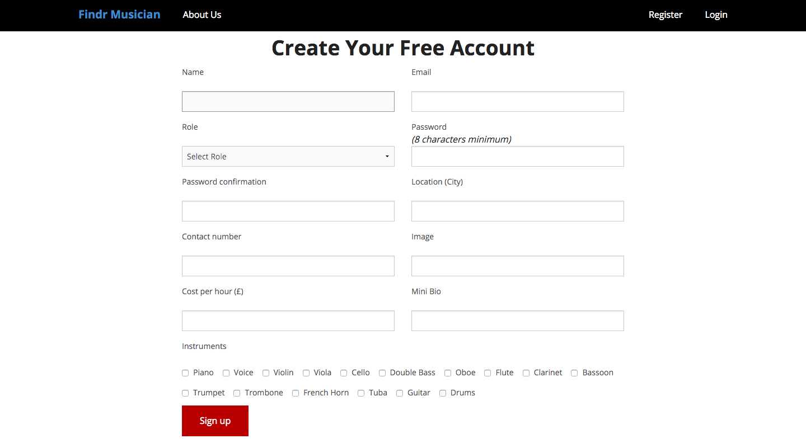

# WDI-Project-2

Second Project

Ruby on Rails Website

Findr Musician

##The Idea:

- As a musician, choosing to move to a new City can be a massive decision, as on average it takes around two years to get yourself known in the area - to build up a client base of students to teach, or to be asked to play in paid gigs.
- So I thought to myself - wouldn't it be good to have a website where students can register to find a music teacher for the instrument or instruments of their choice, and where music teachers can also register a profile so that they can be contacted by potential students and build up a client base that way.
- So this is why I have designed and created a web application called Findr Musician - and I would love to give you a demo of this now.

##Screenshots

The homepage.

Register.

Login.

The about us page.

Searching for a music teacher.

The results.

Teacher profile page.

Booking a lesson.

Checking upcoming lessons.

##Technologies used:

In this project I have used HTML, CSS, Javascript, JQuery, Ruby and Rails.

##Approach taken:

- Brainstormed some possible ideas
- Made a plan using the chosen idea
- Created a Trello board outlining what needed to be done, and depending on their importance, the order in which they needed to be executed.
- Produced an ERD diagram, mapping out the models and their relationships with one another.
- Created wireframes using Balsamiq, displaying how I imagined the website and its various pages to look.
- I then created a few test projects. After setting up the first test without Devise, I created the second with a User model using Devise and a scaffolded Instrument and Lesson models.
- Then I tested the relationships in the Rails console.
- Once the basics of this was all working as expected, I created the main project, replicating the models created in the test.
- I installed the Foundation gem and added some basic HTML structure and SCSS styling.
- After this I concentrated on getting all the associations to work correctly.
- Once the majority of the functionality was working, I installed the Ransack gem to allow me to add search features to my app.
- I then went back to the styling - using Foundation to make the app look as good as possible.

##Challenges:

- One of the main challenges I had was implementing the Ransack gem for the search features.
-
-
-
-
-
-
-
-
-
-

##If I had more time:

###There are a number of features I would have liked to have added or take further

- I would have liked to add a calendar booking system - using the gem Bookable. Able to check the availability of the teacher when making a booking.
- Create user roles and permissions using the Rolify and CanCan gems.
- Search by Post Code - allowing you to find teachers closest to you.
- Having a map with the location of your nearest teachers.
- Added a photo uploader so that the users can upload their own image.
- Create an online portal for teachers and students to communicate inbetween lessons - including online chat, and an area for notes/recommendations.
- Add a rating/comments system to find the best teachers.
- Create an online payment system for lessons - so that no payment has to be made at the lesson itself.
- Add additional cities.
- Add additional information to the profile pages of the teachers to help the students to decide who to have lessons with.
- Refacter the code - make it dryer.

- Plans to branch out/spin-offs - such as:
  - Findr Plumber
  - Findr Gardener
  - Findr Window Cleaner

